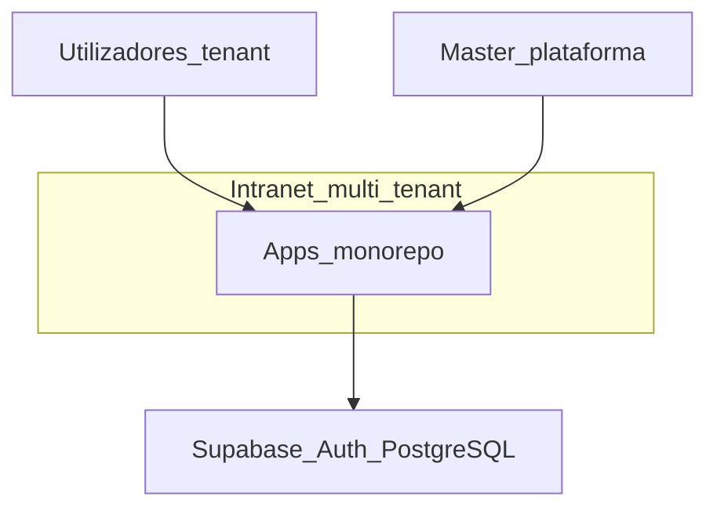
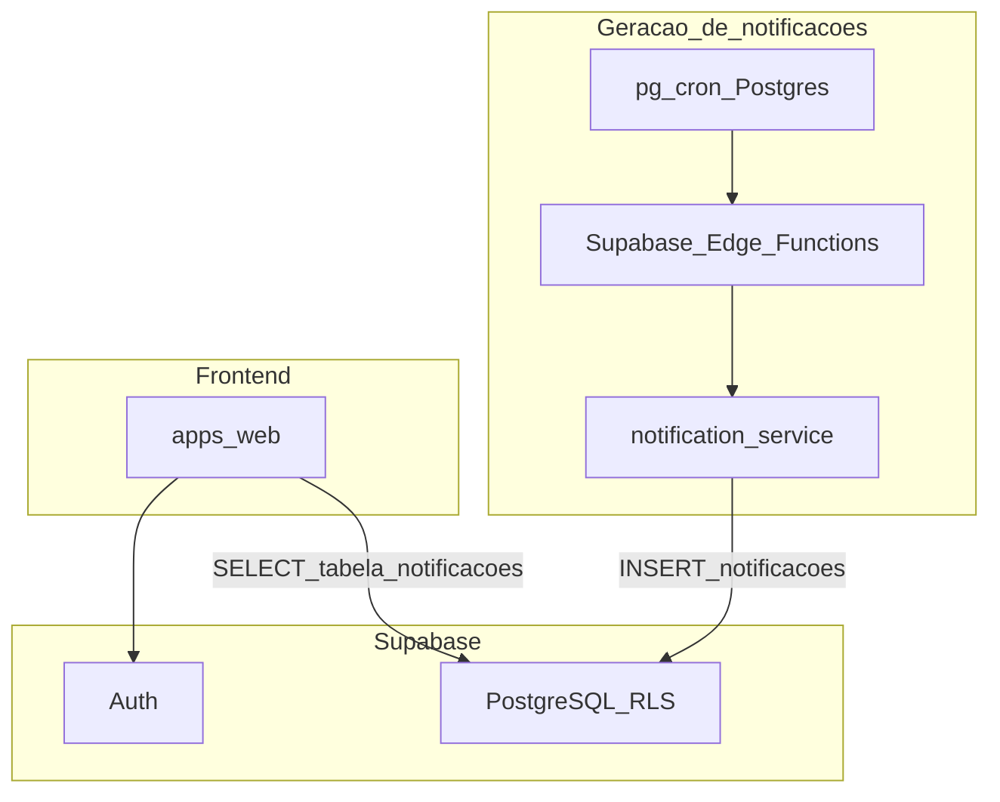
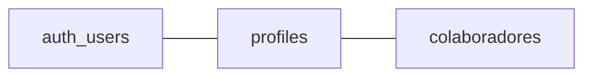

# Arquitetura técnica (planta)

## Propósito e âmbito

Este documento é a **planta técnica** do sistema: **contentores** de software, **fluxos de confiança** e **dados**, modelo **multi-tenant** com PostgreSQL e **RLS**, e **fronteiras** entre aplicações e o Supabase.

**Complementa** o [PROPOSAL.md](./PROPOSAL.md) (produto), o [ENGINEERING.md](./ENGINEERING.md) (stack, monorepo, testes), o [SECURITY.md](./SECURITY.md) (políticas), o [DELIVERY.md](./DELIVERY.md) (Git, CI, deploy) e o [QUALITY.md](./QUALITY.md) (código e revisão).

**Não substitui** a matriz RBAC nem requisitos funcionais; **não** define políticas SQL linha-a-linha (isso vive em **migrações** e, quando útil, em **ADRs**). **Decisões pontuais** (escolha de fila, formato exacto de payload, mudanças controversas) devem ser registadas em **ADRs** ou atualizações pontuais deste documento.

---

## Contexto do sistema (C4 — nível de contexto)

Utilizadores autenticados acedem à **aplicação web** no âmbito do seu **tenant** (excepto o perfil **Master**, que opera no plano **plataforma**, com limites de dados descritos no PROPOSAL). A plataforma depende do **Supabase** para identidade (**Auth**) e persistência relacional (**PostgreSQL**) com **Row Level Security**.

---

## Contentores (C4 — nível de contentores)

| Contentor | Tecnologia | Responsabilidade principal |
|-----------|------------|----------------------------|
| **`apps/web`** | Next.js, React, TypeScript | UI; **validação server-side** de tenant e autorização; **leitura** das notificações in-app a partir das **tabelas** no PostgreSQL (via Supabase, com **RLS**). **Fase inicial:** **sem** integração HTTP directa do browser com o `notification-service` — apenas leitura de dados já persistidos. |
| **`apps/notification-service`** | Fastify, TypeScript | Recebe pedidos da orquestração (**Cron PostgreSQL** + **Edge Functions**); **persiste** notificações **directamente na base de dados** (inserção nas tabelas de domínio). *Pasta alvo — pode ainda não existir no repositório.* |
| **Supabase Edge Functions** | Deno/TS (Supabase) | Ponte na **geração** de notificações: comunicação com o `notification-service` conforme contrato (HTTP ou equivalente). |
| **PostgreSQL (pg_cron)** | Extensão / agendamento | **Cron** no Postgres para disparar ou apoiar a cadência de geração de notificações (em conjunto com Edge Functions — detalhe de encadeamento em migrações ou ADR). |
| **Supabase** | Auth + PostgreSQL + APIs | **Fonte de verdade** identidade (`auth.users`) e dados relacionais; **RLS** como barreira de isolamento por `tenant_id`. |

**Leitura vs escrita (notificações):** o **`apps/web`** **lê** a tabela de notificações (e metadados associados) via stack Supabase; a **escrita** de novas linhas é responsabilidade do **`notification-service`**, invocado pelo fluxo **Cron + Edge Functions**. O **cliente** (browser) **não** é fonte de verdade para `tenant_id` nem para permissões — ver [SECURITY.md](./SECURITY.md).

---

## Modelo de identidade e dados (encadeamento)

Encadeamento conceptual alinhado ao [PROPOSAL.md](./PROPOSAL.md):

`auth.users` (Supabase Auth) **↔** `profiles` (ou equivalente — vínculo ao **tenant** e **papel**) **↔** `colaboradores` (dados de pessoas quando o utilizador tem ficha).

As entidades de negócio dos módulos **GD** / **GC** / **GE** (departamentos, colaboradores, eventos, audiências, notificações) residem no **PostgreSQL** com **`tenant_id`** e políticas **RLS**; o **detalhe de colunas, índices e funções** é definido nas **migrações** do projeto Supabase (ex. sob [`apps/web`](../apps/web) ou pasta acordada pela equipa).

---

## Multi-tenant e RLS (visão de arquitetura)

- **Base partilhada** com coluna **`tenant_id`** nas tabelas de negócio; **isolamento** entre organizações garantido por **Row Level Security (RLS)** — não apenas por filtros na aplicação.
- Toda a **leitura e escrita** de dados sensíveis ao tenant deve passar por caminhos onde o **papel** do utilizador e o **tenant** estão reflectidos nas políticas (e, na aplicação, validação **no servidor**).
- **Plano Master:** acesso a dados de tenants apenas no formato de **agregados** (ex.: contagens), conforme PROPOSAL; a modelagem (views, funções `SECURITY DEFINER` controladas, etc.) é decisão de implementação documentada em migrações ou ADR quando não for óbvia.

---

## Fluxos técnicos relevantes (resumo)

- **Primeiro acesso e reset de palavra-passe:** links gerados pela **aplicação** (serviços server-side), sem email nativo do Supabase para esses fluxos — implicações de segurança e validação em [SECURITY.md](./SECURITY.md).
- **Notificações in-app:** atreladas ao domínio de **eventos**; **geração** orquestrada por **Cron (PostgreSQL)** e **Supabase Edge Functions**, que se comunicam com o **`notification-service`**, o qual **grava** na base. **Leitura** no **frontend** a partir da **tabela** (RLS), sem chamada directa ao serviço na fase inicial — ver secção dedicada abaixo.

---

## Geração e leitura de notificações in-app

| Fase | Quem escreve | Quem lê |
|------|----------------|---------|
| **Geração** | **pg_cron** (Postgres) e **Edge Functions** (Supabase) disparam/comunicam com **`apps/notification-service`**, que **insere** registos na(s) tabela(s) de notificações (e dados relacionados) no **PostgreSQL**. | — |
| **Consulta na app** | — | **`apps/web`** via cliente Supabase (**SELECT** com políticas **RLS**); **não** há, **de início**, integração HTTP directa do **frontend** com o `notification-service`. |

- O **contrato** entre **Edge Functions** e **`notification-service`** (e eventualmente entre **Cron** e **Edge**) deve ser **estável** e testável — ver [ENGINEERING.md](./ENGINEERING.md).
- Uma **fase posterior** pode introduzir chamadas directas ou canais adicionais (ex.: tempo real); alterações de fronteira devem ser **ADR** ou nova versão desta planta.

---

## Integração entre contentores (notificações)

- **Não** se assume que o **browser** chama o `notification-service`: a fronteira de **escrita** passa pelo pipeline **Cron / Edge → notification-service → PostgreSQL**.
- **Contrato estável** (OpenAPI, tipos partilhados) entre **Edge Functions** e **`notification-service`** para desenvolvimento e testes **independentes** do frontend.
- Evoluções como **filas dedicadas**, **webhooks** ou **push** para o cliente podem ser introduzidas com **ADR** se alterarem fronteiras ou semântica de entrega.

---

## Deploy e ambientes (visão de arquitectura)

O **fluxo Git**, **CI de testes unitários** no PR (GitHub Actions), e o **deploy** para **hml** / **prod** (monitorização de commits em `develop` / `main`, etc.) estão descritos no [DELIVERY.md](./DELIVERY.md). Este documento não duplica esse processo operacional.

---

## ADRs e evolução

- **ADRs** (Architecture Decision Records): decisões com alternativas, trade-offs ou histórico relevante (ex.: estratégia de auditoria, escolha de fila).
- Alterações à **planta** (novos contentores, mudança de fronteira forte) devem **versionar** este ficheiro e ser revistas pela equipa técnica.

---

## Evolução documental

| Campo | Valor |
|--------|--------|
| **Versão** | 1.1 |
| **Data** | 2026-04-02 |
| **Alterações em 1.1** | Notificações: geração via **pg_cron** + **Edge Functions** → **notification-service** → BD; **frontend** lê só a tabela (sem integração directa com o serviço na fase inicial). |

---

**Documento:** planta técnica (complementar ao [ENGINEERING.md](./ENGINEERING.md) e ao [PROPOSAL.md](./PROPOSAL.md)).