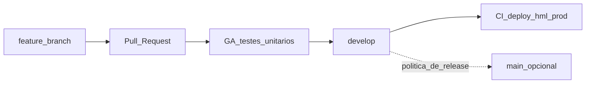

# Entrega e integração (Git)

## Propósito e âmbito

Este documento define **como** as implementações são entregues no repositório: **branches dedicadas**, **Pull Requests** para a branch de integração (**`develop`**), e a **relação** com **CI** e **deploy** para ambientes de homologação e produção.

**Complementa** o [QUALITY.md](./QUALITY.md) (critérios de código, revisão, definição de pronto) e o [ENGINEERING.md](./ENGINEERING.md) (stack, monorepo, princípio de implementação incremental). **Não** define regras de produto — ver [PROPOSAL.md](./PROPOSAL.md).

**Cobre:** fluxo Git; destino dos PRs; **CI no PR** (GitHub Actions com testes unitários como referência de aprovação); **deploy** hml/prod (monitorização de commits, sem depender deste workflow para publicar).

**Não cobre:** detalhe linha-a-linha dos ficheiros `.github/workflows` (mantidos no repositório); detalhe operacional de pipelines de **deploy** na infraestrutura (jobs, segredos, mapeamento exacto branch→ambiente), SLAs ou runbooks — **a definir com a equipa de infraestrutura** quando necessário.

---

## Branch por implementação

- Cada **implementação** (funcionalidade, correção ou conjunto coerente de alterações) deve ser desenvolvida numa **branch específica**, separada de **`develop`**.
- A equipa pode convencionar prefixos (ex.: `feature/`, `fix/`, `chore/`) — o importante é **uma branch por entrega** rastreável até ao PR.
- **Evitar** commits directos em **`develop`** para trabalho que deva ser revisto e validado via PR. Excepções pontuais (ex.: hotfix) ficam **por acordo** da equipa e devem ser comunicadas.

---

## Pull Request para `develop`

- Ao **finalizar** o trabalho na branch de feature, abre-se um **Pull Request** com destino **`develop`**.
- O PR deve ter **título e descrição** suficientes para revisão e histórico (contexto, referência a issue/tarefa se existir).
- O **merge** em **`develop`** ocorre após **revisão** alinhada ao [QUALITY.md](./QUALITY.md), cumprimento da **definição de pronto** acordada e, quando aplicável, **aprovação assistida pelo resultado dos testes unitários** no CI do PR (ver secção seguinte).

---

## CI no Pull Request (GitHub Actions)

- Este repositório prevê **workflow(s) GitHub Actions** cuja função é executar **apenas testes unitários** (ex.: **Vitest**, conforme [ENGINEERING.md](./ENGINEERING.md)).
- O **resultado do workflow** (sucesso ou falha) serve de **referência para a aprovação do Pull Request** — em conjunto com a **revisão humana**; não substitui o juízo da equipa nem os critérios do [QUALITY.md](./QUALITY.md).
- O **deploy** para ambientes **não** é obrigatório neste workflow; o foco é **feedback rápido** em código e regressões nas regras de negócio cobertas por testes.

---

## Deploy (homologação e produção)

- Para **hml** e **prod**, o repositório está associado a **CI automático** / **integração** que suporta **deploy** conforme a **configuração** ligada ao projeto, em geral por **monitorização de novos commits** em branches acordadas (**`develop`**, **`main`**, etc.).
- Este mecanismo de **deploy** pode ser **independente** dos ficheiros de workflow usados só para **testes unitários** no PR: a infra define **o que** dispara **qual** ambiente.
- O mapeamento **exacto** (qual branch alimenta **hml** vs **prod**, uso de **`main`**, etc.) é **definido pela infraestrutura** e deve ser conhecido pela equipa; atualizar este documento ou um runbook interno quando esse mapeamento for estável.

---

## Fluxo resumido

**Legenda:** **GA** = GitHub Actions (testes unitários no PR). **CI/deploy** em **`develop`** (e eventualmente **`main`**) segue a configuração de infra para **hml/prod**. A ligação **`develop` → `main`** (se existir) depende da política de release da organização.

---

## Ligação com qualidade e engenharia

- O merge do PR só deve ocorrer quando a entrega cumpre o [QUALITY.md](./QUALITY.md) (testes locais ou esperados, revisão, ausência de segredos no diff) e quando o **workflow de testes unitários** (se correr neste PR) está **coerente** com a decisão de merge — falhas devem ser investigadas antes de integrar.
- O **deploy** pós-merge em **`develop`** é tratado pela camada de infra descrita na secção **Deploy**; não confundir com o job de **testes unitários** no GitHub Actions.

---

## Evolução documental

| Campo | Valor |
|--------|--------|
| **Versão** | 1.1 |
| **Data** | 2026-04-02 |
| **Alterações em 1.1** | GitHub Actions no repositório: **apenas testes unitários** no PR, como referência de aprovação; deploy hml/prod mantém-se como monitorização de commits / infra. |

Alterações a **DELIVERY.md** devem ser revistas pela **equipa técnica** e, quando afetarem processos de release, comunicadas à **infraestrutura** ou responsáveis pelo CI.

---

**Documento:** entrega e integração Git (complementar ao [QUALITY.md](./QUALITY.md) e ao [ENGINEERING.md](./ENGINEERING.md)).