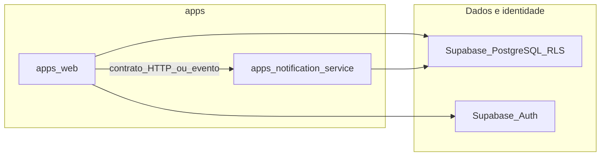

# Engenharia do repositório

## Propósito e âmbito

Este documento define o **contrato de engenharia** do monorepo: stack acordada, organização de `apps/`, princípios de implementação **incremental e testável**, e expectativas de **clareza funcional** e **testes** alinhadas ao produto e à governação.

**Complementa** o [PROPOSAL.md](./PROPOSAL.md) (requisitos e desenho de produto) e o [GOVERNANCE.md](./GOVERNANCE.md) (papéis, SoD, operação). **Não** redefine perfis, matriz RBAC, MVP nem processos de aprovação de produto.

**Cobre:** linguagens e frameworks por aplicação; convenções de repositório; princípios para entregar valor sem bloquear validação em trabalho futuro; testes unitários em torno de regras de negócio; resumo de qualidade e segurança técnica.

**Não cobre:** política legal completa (RGPD), SLAs numéricos, runbooks de infraestrutura, backups operacionais — ver PROPOSAL e GOVERNANCE. **Decisões de arquitetura profundas** (pormenores de políticas RLS, diagramas de deployment) podem viver em `ARCHITECTURE.md` ou **ADRs** quando existirem.

---

## Stack e aplicações no monorepo

| Camada / aplicação | Tecnologia | Local no repositório |
|--------------------|------------|----------------------|
| **Frontend** | Next.js, React, TypeScript, Tailwind CSS, **Shadcn UI** | [`apps/web`](../apps/web) |
| **Serviço de notificações** | **Fastify** (Node.js, TypeScript) — API/serviço dedicado a notificações **in-app** e integrações associadas (contratos HTTP ou eventos conforme desenho) | `apps/notification-service` (nome alvo; criar quando a equipa iniciar o serviço) |
| **Dados e identidade** | **Supabase Auth** (`auth.users`), PostgreSQL, **Row Level Security (RLS)** como barreira principal de isolamento por tenant | Esquema e políticas no projeto Supabase (ex. sob `apps/web` ou pasta de migrações acordada) |

O contexto de **tenant** e **papel** deve ser **validado no servidor** e reforçado por **RLS**, nunca inferido apenas no cliente — ver [PROPOSAL.md](./PROPOSAL.md). A matriz de permissões por perfil não se repete aqui; a implementação deve mapeá-la a recursos, rotas e políticas conforme o PROPOSAL.

---

## Estrutura do repositório (`apps/`)

- Cada aplicação **deployável** (frontend, serviço HTTP, workers) reside sob **`apps/<nome>`**, com o seu próprio manifesto de dependências (ex. `package.json`) quando aplicável.
- **`packages/`** (tipos partilhados, regras de domínio puras, utilitários) só deve ser introduzido quando existir **necessidade real** de partilha entre apps — evitar antecipar pacotes “por defeito”.

O monorepo pode evoluir para **workspaces** na raiz (npm/pnpm/yarn); o estado exato do tooling é decisão da equipa e não precisa estar fixado neste documento.

---

## Princípio de implementação independente

**Nenhuma entrega deve depender de uma implementação futura para ser testada, revista ou demonstrada.** Traduz-se em práticas concretas:

1. **Fatias verticais:** preferir incrementos que incluam um **recorte mínimo** de domínio, persistência (ou contrato com a base) e, quando fizer sentido, UI ou endpoint — cada fatia **compila, corre e pode ser validada** isoladamente.
2. **Inversão de dependências:** regras de negócio e políticas (por exemplo: quem pode eliminar eventos; que papéis o RH pode atribuir; invariantes de `tenant_id`) residem em **módulos puros** testáveis **sem** UI nem cliente Supabase real; integrações (Supabase, HTTP, filas) ficam atrás de **interfaces** substituíveis por doubles em teste.
3. **Sem stubs permanentes ambíguos:** evitar código que só “ganha sentido” quando outro módulo existir; preferir **contratos estáveis** (OpenAPI, tipos partilhados), **adapters no-op**, ou **feature flags** documentados até o consumidor existir.
4. **Notification service:** o serviço Fastify pode ser desenvolvido e testado com **contrato HTTP ou de evento** definido cedo, **sem** exigir o fluxo completo da `apps/web` no mesmo incremento — desde que o contrato e os testes do serviço cubram o comportamento acordado.

---

## Clareza funcional e testes

### Clareza funcional

- Nomes de módulos, funções e tipos devem refletir a **linguagem do domínio** do PROPOSAL (tenant, colaborador, evento, audiência, departamento, etc.).
- Onde uma regra de [GOVERNANCE.md](./GOVERNANCE.md) ou do PROPOSAL se aplica (por exemplo segregação Admin vs RH), o código pode incluir **comentário mínimo** ou **referência ao teste** que a prova — sem duplicar parágrafos de documentação.

### Testes unitários

- São **obrigatórios** para **regras de negócio** derivadas do PROPOSAL e da governação: exemplos incluem **matriz de permissões** por recurso/ação, **regras de audiência** de eventos (âmbito empresa, departamento, colaboradores específicos), **invariantes de tenant**, e limites **Master** (apenas agregados, sem detalhe de linhas).
- Testes unitários **não** substituem a verificação de **RLS** e políticas SQL; servem para lógica aplicacional e validações que devem permanecer consistentes com as políticas da base.

### Testes de integração e E2E

- São **complementares**: validar integração com PostgreSQL/Supabase (por exemplo projeto de teste ou Supabase local), fluxos críticos na aplicação web, e contratos entre `apps/web` e `apps/notification-service` quando existirem.
- **Ferramentas concretas** (framework de E2E, estratégia de CI) ficam **a definir** pela equipa e podem ser registadas neste documento ou em ADR quando estiverem estáveis.

---

## Qualidade e segurança (resumo técnico)

Alinhado aos requisitos não funcionais do [PROPOSAL.md](./PROPOSAL.md):

- **Sem API HTTP pública** da aplicação para exposição genérica de dados de tenant; acesso através da app autenticada e políticas alinhadas com RLS.
- **Validação server-side** do contexto de tenant e autorização; o cliente não é fonte de verdade para isolamento.
- **Segurança web:** mitigação de XSS/CSRF conforme boas práticas da stack Next.js e do browser.
- **Segredos** apenas em variáveis de ambiente ou segredos geridos — nunca em repositório.
- **Backups, RPO/RTO, disponibilidade:** não fixados aqui; ver PROPOSAL e acordo com infraestrutura.

---

## Vista de alto nível (alvo)

Diagrama conceptual das fronteiras; o detalhe de filas, esquemas de mensagens e deployment fica para `ARCHITECTURE.md` ou ADRs.

---

## Evolução documental

| Campo | Valor |
|--------|--------|
| **Versão** | 1.0 |
| **Data** | 2026-04-02 |

Alterações a **ENGINEERING.md** devem ser revistas pela **equipa técnica**. Mudanças que alterem profundamente arquitetura ou trade-offs duradouros devem ser acompanhadas de **ADR** ou atualização de `ARCHITECTURE.md` quando existirem.

---

**Documento:** engenharia do repositório (complementar ao [PROPOSAL.md](./PROPOSAL.md) e ao [GOVERNANCE.md](./GOVERNANCE.md)).