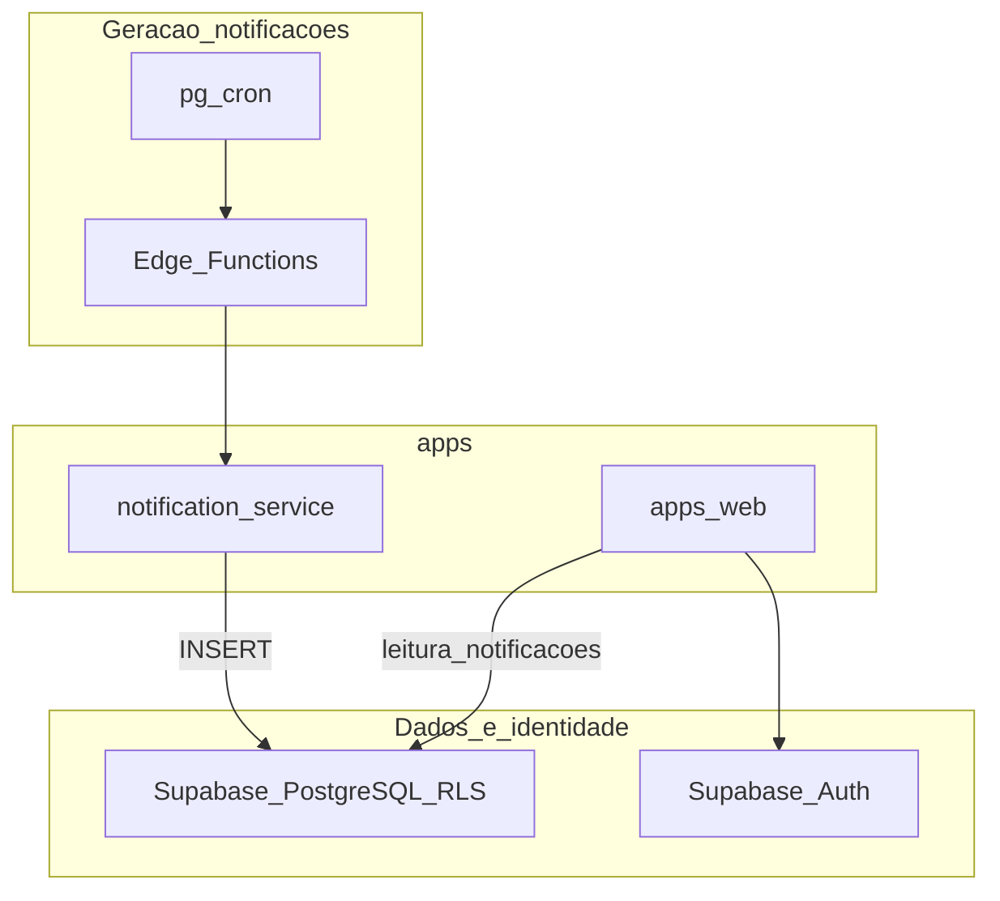

# Engenharia do repositório

## Propósito e âmbito

Este documento define o **contrato de engenharia** do monorepo: stack acordada, organização de `apps/`, princípios de implementação **incremental e testável**, e expectativas de **clareza funcional** e **testes** alinhadas ao produto e à governação.

**Complementa** o [PROPOSAL.md](./PROPOSAL.md) (requisitos e desenho de produto), o [GOVERNANCE.md](./GOVERNANCE.md) (papéis, SoD, operação), o [SECURITY.md](./SECURITY.md) (políticas de segurança na aplicação), o [QUALITY.md](./QUALITY.md) (código limpo, critérios de testes, revisão, definição de pronto), o [DELIVERY.md](./DELIVERY.md) (branches, PR para `develop`, CI/deploy) e o [ARCHITECTURE.md](./ARCHITECTURE.md) (planta técnica: contentores, dados, RLS). **Não** redefine perfis, matriz RBAC, MVP nem processos de aprovação de produto.

**Cobre:** linguagens e frameworks por aplicação; convenções de repositório; princípios para entregar valor sem bloquear validação em trabalho futuro; **Vitest** para testes automatizados; E2E com **Cursor Browser MCP** (agentes) e **Playwright** (CI); resumo de segurança técnica. O detalhe de **legibilidade, padrões de código e DoD** está no [QUALITY.md](./QUALITY.md). O fluxo **Git e integração** está no [DELIVERY.md](./DELIVERY.md). A **planta técnica** (diagramas de contentores, encadeamento de dados, fronteiras) está no [ARCHITECTURE.md](./ARCHITECTURE.md).

**Não cobre:** política legal completa (RGPD), SLAs numéricos, runbooks de infraestrutura, backups operacionais — ver PROPOSAL e GOVERNANCE. **Pormenores de políticas RLS**, desenho de deployment e integrações entre serviços — ver [ARCHITECTURE.md](./ARCHITECTURE.md); decisões pontuais controversas em **ADRs** quando existirem.

---

## Stack e aplicações no monorepo

| Camada / aplicação | Tecnologia | Local no repositório |
|--------------------|------------|----------------------|
| **Frontend** | Next.js, React, TypeScript, Tailwind CSS, **Shadcn UI** | [`apps/web`](../apps/web) |
| **Serviço de notificações** | **Fastify** (Node.js, TypeScript) — API/serviço dedicado a notificações **in-app** e integrações associadas (contratos HTTP ou eventos conforme desenho) | `apps/notification-service` (nome alvo; criar quando a equipa iniciar o serviço) |
| **Dados e identidade** | **Supabase Auth** (`auth.users`), PostgreSQL, **Row Level Security (RLS)** como barreira principal de isolamento por tenant | Esquema e políticas no projeto Supabase (ex. sob `apps/web` ou pasta de migrações acordada) |

O contexto de **tenant** e **papel** deve ser **validado no servidor** e reforçado por **RLS**, nunca inferido apenas no cliente — ver [PROPOSAL.md](./PROPOSAL.md). A matriz de permissões por perfil não se repete aqui; a implementação deve mapeá-la a recursos, rotas e políticas conforme o PROPOSAL.

---

## Estrutura do repositório (`apps/`)

- Cada aplicação **deployável** (frontend, serviço HTTP, workers) reside sob **`apps/<nome>`**, com o seu próprio manifesto de dependências (ex. `package.json`) quando aplicável.
- **`packages/`** (tipos partilhados, regras de domínio puras, utilitários) só deve ser introduzido quando existir **necessidade real** de partilha entre apps — evitar antecipar pacotes “por defeito”.

O monorepo pode evoluir para **workspaces** na raiz (npm/pnpm/yarn); o estado exato do tooling é decisão da equipa e não precisa estar fixado neste documento.

---

## Princípio de implementação independente

**Nenhuma entrega deve depender de uma implementação futura para ser testada, revista ou demonstrada.** Traduz-se em práticas concretas:

1. **Fatias verticais:** preferir incrementos que incluam um **recorte mínimo** de domínio, persistência (ou contrato com a base) e, quando fizer sentido, UI ou endpoint — cada fatia **compila, corre e pode ser validada** isoladamente.
2. **Inversão de dependências:** regras de negócio e políticas (por exemplo: quem pode eliminar eventos; que papéis o RH pode atribuir; invariantes de `tenant_id`) residem em **módulos puros** testáveis **sem** UI nem cliente Supabase real; integrações (Supabase, HTTP, filas) ficam atrás de **interfaces** substituíveis por doubles em teste.
3. **Sem stubs permanentes ambíguos:** evitar código que só “ganha sentido” quando outro módulo existir; preferir **contratos estáveis** (OpenAPI, tipos partilhados), **adapters no-op**, ou **feature flags** documentados até o consumidor existir.
4. **Notification service:** o serviço Fastify é alimentado pela orquestração **Cron (Postgres) + Edge Functions** (ver [ARCHITECTURE.md](./ARCHITECTURE.md)) e **persiste** na base; o **`apps/web`** **lê** a tabela de notificações, **sem** integração HTTP directa com o serviço **na fase inicial**. Pode ser desenvolvido e testado com **contrato** (HTTP/evento) com as Edge Functions, **sem** exigir o fluxo completo da UI no mesmo incremento.

---

## Clareza funcional e testes

### Clareza funcional

- Nomes de módulos, funções e tipos devem refletir a **linguagem do domínio** do PROPOSAL (tenant, colaborador, evento, audiência, departamento, módulos **GD** / **GC** / **GE**, etc.).
- Onde uma regra de [GOVERNANCE.md](./GOVERNANCE.md) ou do PROPOSAL se aplica (por exemplo segregação Admin vs RH, **eliminação de eventos** por autor, **self-service** vs campos só Admin/RH), o código pode incluir **comentário mínimo** ou **referência ao teste** que a prova — sem duplicar parágrafos de documentação.

### Ferramentas de teste (decisão)

| Camada | Ferramenta | Função |
|--------|------------|--------|
| **Unitários e integração** (TypeScript no monorepo) | [**Vitest**](https://vitest.dev/) | Executar testes de regras de negócio, módulos puros e integração leve (mocks, doubles); alinhar com a stack Node/TS das apps. |
| **E2E de UI (desenvolvimento / agentes)** | **Cursor Browser MCP** | Navegação e interação com a aplicação via **agentes no Cursor** para explorar fluxos, regressões rápidas e cenários assistidos por IA — **não** substitui a suíte reprodutível no CI. |
| **E2E de UI (CI)** | [**Playwright**](https://playwright.dev/) | Testes E2E **estáveis e reprodutíveis** na pipeline de integração contínua (build, PRs, releases). |

### Testes unitários e de integração (Vitest)

- O runner e a API de asserção padrão para código testável no repositório é **Vitest** (incluindo testes que exercitem módulos com dependências simuladas). No **CI de Pull Request**, prevê-se **GitHub Actions** a executar **apenas** esta suíte, como **referência para aprovação** do PR — ver [DELIVERY.md](./DELIVERY.md).
- São **obrigatórios** para **regras de negócio** derivadas do PROPOSAL e da governação: exemplos incluem **matriz de permissões** por recurso/ação, **regras de audiência** de eventos (âmbito empresa, departamento, colaboradores específicos), **quem pode apagar qual evento** (Admin vs autor RH), **campos editáveis em self-service** vs **Admin/RH**, **invariantes de tenant**, e limites **Master** (apenas agregados, sem detalhe de linhas).
- Testes unitários **não** substituem a verificação de **RLS** e políticas SQL; servem para lógica aplicacional e validações que devem permanecer consistentes com as políticas da base. Integração com PostgreSQL/Supabase (projeto de teste, Supabase local) complementa Vitest onde fizer sentido.

### Testes E2E de UI

- **Cursor Browser MCP:** uso em **fluxo de desenvolvimento** com agentes — validação de UI e jornadas sem depender de outro módulo ainda não existente, alinhado ao princípio de implementação independente.
- **Playwright:** fonte de verdade para **E2E na CI** — regressão automática, gates em PR e ambientes de integração; manter cenários críticos alinhados ao PROPOSAL (perfis, isolamento de tenant, fluxos de eventos) à medida que o produto evolui.

---

## Qualidade e segurança (resumo técnico)

Resumo alinhado ao [PROPOSAL.md](./PROPOSAL.md); o detalhe de políticas está em [SECURITY.md](./SECURITY.md). Expectativas de **código legível, testes e revisão** estão em [QUALITY.md](./QUALITY.md).

- **Sem API HTTP pública** da aplicação para exposição genérica de dados de tenant; acesso através da app autenticada e políticas alinhadas com RLS.
- **Validação server-side** do contexto de tenant e autorização; o cliente não é fonte de verdade para isolamento.
- **Segurança web:** mitigação de XSS/CSRF conforme boas práticas da stack Next.js e do browser.
- **Segredos** apenas em variáveis de ambiente ou segredos geridos — nunca em repositório.
- **Backups, RPO/RTO, disponibilidade:** não fixados aqui; ver PROPOSAL e acordo com infraestrutura.

---

## Vista de alto nível (alvo)

Diagrama conceptual das fronteiras; o detalhe de filas, esquemas de mensagens e deployment fica para [ARCHITECTURE.md](./ARCHITECTURE.md) ou ADRs.

Notificações: **escrita** via **Cron + Edge → notification-service → BD**; **leitura** no **web** pela tabela (sem chamada directa ao serviço no browser, fase inicial). Detalhe em [ARCHITECTURE.md](./ARCHITECTURE.md).

---

## Evolução documental

| Campo | Valor |
|--------|--------|
| **Versão** | 1.8 |
| **Data** | 2026-04-02 |
| **Alterações em 1.8** | Diagrama e princípio de notificações: Cron + Edge → notification-service → BD; web lê tabela (ver [ARCHITECTURE.md](./ARCHITECTURE.md)). |
| **Alterações em 1.7** | Referência explícita ao [ARCHITECTURE.md](./ARCHITECTURE.md) como planta técnica (contentores, RLS, fronteiras). |
| **Alterações em 1.6** | Vitest no PR via GitHub Actions (referência de aprovação); remete ao [DELIVERY.md](./DELIVERY.md). |
| **Alterações em 1.5** | Referência ao [DELIVERY.md](./DELIVERY.md) para branches, PR e CI/deploy. |
| **Alterações em 1.4** | Referência ao [QUALITY.md](./QUALITY.md) para padrões de código, revisão e definição de pronto. |
| **Alterações em 1.3** | Clareza funcional e exemplos de testes alinhados ao PROPOSAL 2.1 (GD/GC/GE, eventos/autor, self-service). |
| **Alterações em 1.2** | Ligações ao [SECURITY.md](./SECURITY.md); resumo de qualidade remete políticas completas a esse documento. |
| **Alterações em 1.1** | Ferramentas de teste: Vitest; E2E com Cursor Browser MCP (agentes) e Playwright (CI). |

Alterações a **ENGINEERING.md** devem ser revistas pela **equipa técnica**. Mudanças que alterem profundamente arquitetura ou trade-offs duradouros devem ser acompanhadas de **ADR** ou atualização do [ARCHITECTURE.md](./ARCHITECTURE.md).

---

**Documento:** engenharia do repositório (complementar ao [PROPOSAL.md](./PROPOSAL.md), [GOVERNANCE.md](./GOVERNANCE.md), [SECURITY.md](./SECURITY.md), [QUALITY.md](./QUALITY.md), [DELIVERY.md](./DELIVERY.md) e [ARCHITECTURE.md](./ARCHITECTURE.md)).