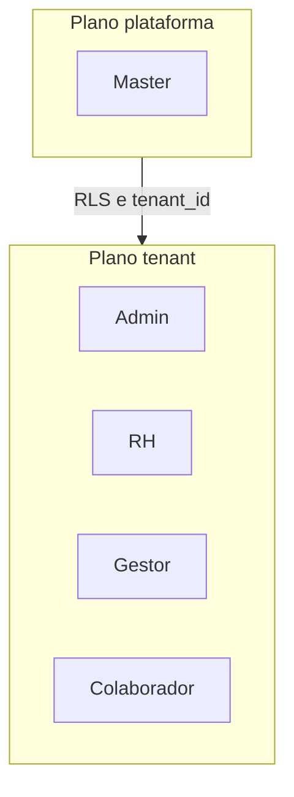

# Governação da plataforma

## Propósito e âmbito

Este documento define **papéis**, **segregação de funções**, **gestão de mudanças**, **operação** e **responsabilidades** sobre a **intranet corporativa multi-tenant** alinhada ao [PROPOSAL.md](./PROPOSAL.md).

**Cobre:** governação entre **plataforma** (vários tenants) e **tenant** (cada organização); regras de autoridade e fronteiras entre perfis; princípios de alteração documental e evolução do produto; responsabilidades operacionais de alto nível.

**Não substitui nem duplica** o [PROPOSAL.md](./PROPOSAL.md) (requisitos e desenho de produto). **Não cobre:** política legal completa de proteção de dados (além dos âmbitos referidos); runbooks técnicos de infraestrutura; detalhe de implementação (ver [ENGINEERING.md](./ENGINEERING.md), futuros `ARCHITECTURE.md` ou ADRs).

---

## Modelo de governação em dois planos

A governação separa o que é **da plataforma** (operador global) do que é **de cada organização** (tenant).

| Plano | Quem | Âmbito |
|--------|------|--------|
| **Plataforma** | **Master** | Ciclo de vida dos tenants, limites/planos globais, configurações que afetam todos os tenants. **Dados dos tenants:** apenas **totais por contagem** (tipo `COUNT`), sem linhas de detalhe, sem impersonação, sem leitura de suporte a registos de negócio. |
| **Tenant** | **Admin**, **RH**, **Gestor**, **Colaborador** | Dados e processos **dentro** da organização; isolamento por **tenant** com **RLS** e validação no servidor, conforme [PROPOSAL.md](./PROPOSAL.md). |

---

## Papéis e responsabilidades

Cada utilizador tem **um único papel** no tenant (quando aplicável). A tabela resume **responsabilidade** (dever) e **autoridade** (poder), em linha com o PROPOSAL.

| Perfil | Responsabilidade principal | Autoridade (resumo) |
|--------|----------------------------|---------------------|
| **Master** | Garantir operação e gestão correta dos **tenants** na plataforma sem aceder a dados de negócio em detalhe. | CRUD de tenants; dashboard com **apenas contagens** por tenant; sem dados pessoais nem listagens de RH. |
| **Admin** | Garantir configuração da organização, **utilizadores**, **papéis** e **acessos** conforme política do tenant. | Qualquer papel (incluindo Admin); **único** que **elimina eventos**; criar/editar eventos; parametrização do tenant (sem white-label no MVP). |
| **RH** | Garantir cadastro de pessoas, estrutura (departamentos) e eventos **no tenant**, e conformidade operacional de RH. | CRUD colaboradores/estrutura; criar/editar eventos (não eliminar); atribuir apenas **RH**, **Gestor**, **Colaborador** e respetivos acessos; links de primeiro acesso e reset (fluxo definido no PROPOSAL). |
| **Gestor** | Acompanhar equipa e contexto organizacional sem administrar cadastros globais. | Diretório **empresa toda** + foco **equipa**; eventos só leitura/participação; sem criação de eventos. |
| **Colaborador** | Utilizar a intranet no âmbito do seu papel e dados permitidos. | Diretório (campos padrão); perfil próprio onde aplicável; eventos conforme audiência; notificações in-app de eventos (sem email de produto). |

Para a matriz detalhada por área (tenants, colaboradores, eventos, etc.), ver [PROPOSAL.md](./PROPOSAL.md) (secção de matriz RBAC).

---

## Segregação de funções (SoD)

As seguintes **fronteiras** aplicam-se (derivadas do PROPOSAL):

1. **Master vs dados de tenant:** o Master **não** consulta tabelas de negócio, fichas de colaboradores nem dados pessoais; **apenas** agregados numéricos por contagem. **Sem** impersonação de utilizadores de tenant.
2. **Admin vs RH — papéis e acessos:** só **Admin** pode criar/atribuir o papel **Admin**. **RH** pode criar/atribuir **RH**, **Gestor** e **Colaborador** apenas.
3. **Admin vs RH — eventos:** **Admin** e **RH** criam e editam eventos; **apenas Admin** **elimina** eventos.
4. **Ficha vs conta:** um colaborador pode existir **sem** login; **Admin** ou **RH** criam/ativam **acesso** à aplicação quando aplicável.
5. **Um papel por utilizador** — sem acumulação de perfis na mesma conta.
6. **Least privilege** e **auditabilidade:** permissões mínimas necessárias; ações administrativas e alterações em dados sensíveis devem poder ser **auditáveis** (âmbito técnico a definir na implementação — ver NFRs no PROPOSAL).

---

## Gestão de mudanças

### Hierarquia documental

| Documento | Função |
|-----------|--------|
| [PROPOSAL.md](./PROPOSAL.md) | Baseline de **produto**: requisitos, perfis, MVP vs fases, decisões técnicas de alto nível. |
| **GOVERNANCE.md** (este) | Baseline de **governação**: papéis, SoD, operação e responsabilidades. |
| [ENGINEERING.md](./ENGINEERING.md) | Baseline de **engenharia**: stack, estrutura do monorepo (`apps/`), princípios de implementação incremental, testes e qualidade técnica. |
| Futuros `ARCHITECTURE.md` / ADRs | Decisões técnicas detalhadas (pormenores de RLS, deployment, integrações). |

Alterações ao PROPOSAL ou ao GOVERNANCE devem **versionar** o documento (versão e data) e registar alterações relevantes para auditoria interna.

### Proposta e aprovação

| Atividade | Proponente (sugestão) | Aprovador (sugestão) |
|-----------|------------------------|----------------------|
| Mudança ao **GOVERNANCE.md** | Owner de produto / plataforma | Patrocinador da plataforma ou comité designado |
| Mudança ao **PROPOSAL.md** | Equipa de produto | Mesmo nível ou processo interno da organização |

*As células “sugestão” devem ser **substituídas** pelos cargos ou comités reais da sua organização.*

### Evolução funcional

Mudanças de **âmbito de produto** (MVP vs Fase 2, white-label, envio de email de links, etc.) seguem o [PROPOSAL.md](./PROPOSAL.md) e devem ser tratadas como **evolução controlada**: atualizar o PROPOSAL, avaliar impacto em SoD e operação, e comunicar aos responsáveis por tenant (Admin) quando afetar políticas locais.

---

## Operação

### Provisionamento de acesso

- **Primeiro acesso** e **reset de palavra-passe:** links gerados pela **aplicação**; **não** usar envio nativo do Supabase para estes fluxos.
- **MVP:** **Admin** e **RH** obtêm o link **em ecrã**, copiam e entregam ao colaborador por canal à escolha da organização.
- **Pós-MVP (opcional):** envio automático por **email** pelo lado da app, **habilitável** por variáveis de ambiente (conforme PROPOSAL).

### Disponibilidade e backups

Objetivos de **RPO/RTO** e estratégia de **backup** ficam **a definir com infraestrutura** (ver PROPOSAL). Este documento não fixa SLAs numéricos.

### Incidentes e suporte

| Tipo | Responsabilidade típica |
|------|-------------------------|
| **Plataforma** (indisponibilidade global, tenants, visão Master) | **Master** / operação da plataforma (equipa técnica designada). |
| **Organização** (utilizadores, RH, eventos **dentro** do tenant) | **Admin** e **RH** no âmbito do tenant; escalação interna à organização. |

*Tempos de resposta e canais de ticket são **a definir** pela organização.*

---

## Conformidade e auditoria

- **RGPD** e dados pessoais: obrigação de alinhar tratamento de dados (bases legais, retenção, direitos do titular) à implementação e documentação legal — ver NFRs no [PROPOSAL.md](./PROPOSAL.md).
- **Auditoria:** registo de ações sensíveis (quem alterou o quê em cadastros de pessoas e permissões) é requisito de governação; detalhe de campos e retenção **a acordar** na implementação.

---

## Revisão e vigência

| Campo | Valor |
|--------|--------|
| **Versão** | 1.0 |
| **Data** | 2026-04-02 |
| **Próxima revisão sugerida** | A definir (ex.: anual ou quando o PROPOSAL tiver alteração major) |

---

**Documento:** governação da plataforma (complementar ao [PROPOSAL.md](./PROPOSAL.md)).