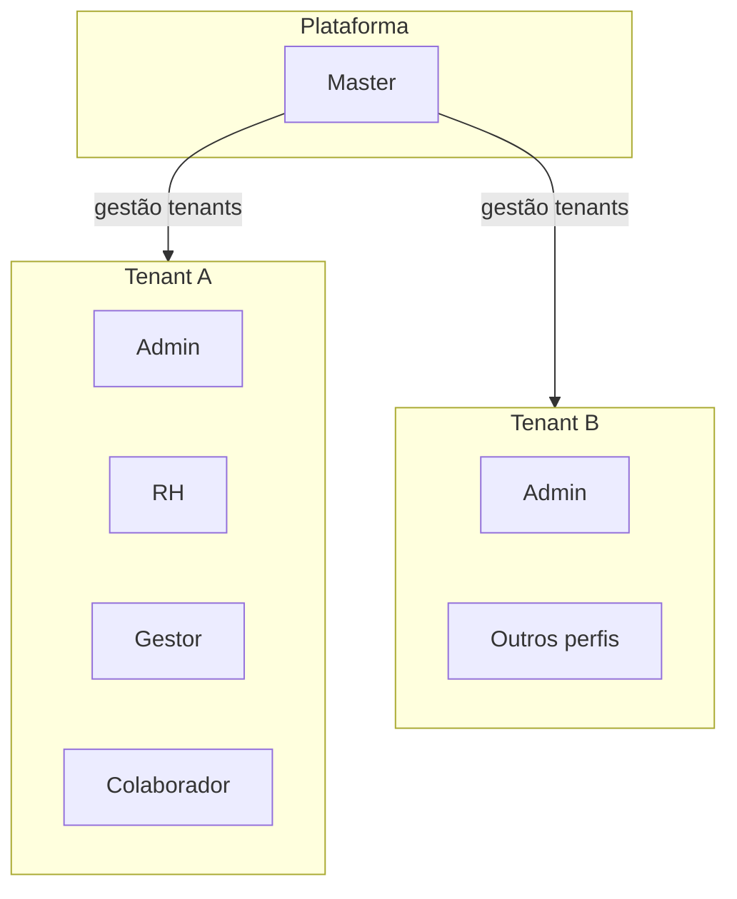

# Proposta: Intranet Corporativa Multi-tenant

## Resumo executivo

Esta proposta descreve uma **Intranet Corporativa Multi-tenant**: uma única aplicação web que serve **várias organizações (tenants)** de forma isolada, com perfis de acesso distintos para operação da plataforma e para a vida interna de cada empresa.

**Objetivos principais:**

- Centralizar comunicação interna, diretório de pessoas, estrutura organizacional (departamentos) e eventos corporativos **por tenant**.
- Garantir que dados e configurações de um tenant **não são acessíveis** a utilizadores de outro tenant, salvo regras explícitas da plataforma (ex.: perfil Master na gestão de tenants).
- Servir como base para evolução modular (MVP focado em pessoas e eventos; fases seguintes para conteúdo avançado e integrações).

**Resultado esperado:** um produto com fronteira clara entre **administração da plataforma** (Master) e **administração da organização** (Admin e restantes perfis no contexto do tenant).

---

## Visão e princípios

1. **Um utilizador opera no contexto de um tenant** (salvo o perfil Master, que gere a plataforma e os tenants).
2. **Dados de negócio são isolados por tenant** — cadastros de colaboradores, departamentos, eventos e configurações locais pertencem exclusivamente à organização.
3. **Separação Master vs Admin:** o Master gere tenants e o ciclo de vida da plataforma; o Admin gere **a sua** organização (utilizadores, papéis e políticas). **White-label por tenant não faz parte do MVP** — identidade visual única da plataforma nesta fase (eventual personalização por tenant em fase posterior).
4. **Least privilege:** cada perfil recebe apenas as permissões necessárias; funções sensíveis (RH, gestão de pessoas) são explicitamente modeladas.
5. **Auditabilidade:** ações administrativas e alterações em dados pessoais devem poder ser registadas (âmbito e detalhe a definir na implementação).
6. **Colaborador registado ≠ utilizador com login:** o cadastro de pessoas pode incluir colaboradores **sem** conta na plataforma; **Admin** e **RH** são responsáveis por **gerar ou ativar o acesso** (credenciais / convite) para quem deve usar a intranet.
7. **Um papel por utilizador:** cada conta tem **um único papel** no tenant (sem acumulação de perfis).
8. **Conta e tenant:** o **email de acesso é corporativo** (por organização); prevê-se **um vínculo por conta** ao tenant — **sem** cenário de utilizador a alternar entre vários tenants na mesma sessão de produto, evitando duplicidade de identidade.
9. **Organização interna:** cada **colaborador** pertence a **um único departamento**; cada colaborador tem **no máximo um gestor**; um **gestor** pode ter **vários** colaboradores na sua equipa.

---

## Autenticação, provisionamento e onboarding (decisões)

- **Autenticação:** **Supabase Auth** com **email e palavra-passe** no login quotidiano (sem **magic link** como método de entrada — ou seja, o utilizador inicia sessão com credenciais, não com um link mágico de login). **Não** está prevista integração com **Active Directory nem SSO** empresarial.
- **Primeiro acesso e reset:** a **aplicação** gera os **links** (**primeiro acesso** — definir palavra-passe inicial; **reset** — reposição de palavra-passe), no **mesmo género** de URL segura (uso único / tempo limitado), **sem** envio por **email nativo do Supabase**. **MVP:** **Admin** e **RH** **visualizam o link em ecrã**, **copiam** e **encaminham manualmente** ao colaborador (ex.: mensagem interna, telefone). **Envio automático do link por email** fica **fora do MVP**, mas prevê-se **habilitável** via **variáveis de ambiente** (ou equivalente); quando ativo, o envio continua **pelo lado da aplicação** (serviço de email integrado), não pelo Supabase.
- **Onboarding:** **não** haverá fluxo de onboarding nem wizard de primeiro uso **dentro da aplicação**; entrada e vínculo ao tenant tratam-se por **provisionamento administrativo** (Admin/RH) e autenticação via Supabase.
- **Quem acede:** nem todo o colaborador com ficha no tenant precisa de ter acesso à app; apenas quem **Admin** ou **RH** der de alta com credenciais passa a ser utilizador autenticado.
- **Notificações:** **não** haverá **notificações por email** de produto (comunicados, digestos, etc.); **notificações in-app** ficam limitadas aos **eventos**. No **MVP**, convite e reset **não** disparam email automático; **após o MVP**, o envio por email de links pode ser **ligado** via configuração (env), **sempre** pelo canal da aplicação, não pelo Supabase (ver secção de primeiro acesso e reset).

---

## Modelo multi-tenant (proposta)

### Abordagem recomendada

**Base de dados partilhada** com coluna **`tenant_id`** nas entidades de negócio, combinada com **Row Level Security (RLS)** no PostgreSQL — **obrigatório** no desenho alvo (Supabase). O isolamento por tenant é **garantido na base**; **não** está prevista **API pública** na aplicação — apenas acesso via app autenticada (e eventualmente serviços internos do Supabase alinhados com RLS).

### Modelo de identidade sugerido (Supabase)

Encadeamento conceptual de dados (a detalhar na implementação):

`auth.users` (Supabase Auth) **↔** `profiles` (ou equivalente — perfil da aplicação / vínculo ao tenant e papel) **↔** `colaboradores` (dados de RH quando o utilizador é também colaborador com ficha).

Após o **login**, o contexto do **tenant** e do **papel** resolve-se a partir desta cadeia e das políticas **RLS**, **nunca** apenas no cliente.

### Resolução do tenant (produto e operações)

**Não** utilizaremos subdomínio nem segmento de caminho na URL para identificar o tenant. O utilizador acede à aplicação pelo endereço canónico (ex.: `app.com`); o **backend** (e a sessão autenticada) ficam responsáveis por **resolver e aplicar o contexto do tenant** — após o login, com base no vínculo da conta ao tenant (email corporativo, **sem** duplicidade de utilizador entre tenants no modelo de produto descrito).

Esta abordagem simplifica DNS e marcadores; a implementação deve garantir que o contexto de tenant é **sempre validado no servidor** e nunca inferido apenas no cliente.

### Diagrama conceptual

---

## Perfis de acesso

| Perfil | Âmbito | Responsabilidades | Exemplos de ações |
|--------|--------|-------------------|-------------------|
| **Master** | Plataforma | Gestão global de tenants, provisionamento, suspensão/ativação; configurações que afetam **todos** os tenants. **Dados dos tenants:** apenas **valores agregados por contagem** (equivalente a `COUNT(*)` / totais numéricos — ex.: número de colaboradores, número de eventos), **sem** listagens, linhas de detalhe, cadastros de RH ou dados pessoais; **sem** impersonação nem leitura de suporte ao detalhe dos tenants. | Criar/editar tenant; definir limites/planos; consultar dashboard com **apenas contagens** por tenant; suporte técnico à plataforma. |
| **Admin** | Tenant | Configuração da organização: domínios de email, integrações autorizadas; **gestão de utilizadores**, **atribuição de papéis** e **geração de acesso** (todos os papéis do tenant, incluindo **Admin**); políticas locais. **Sem white-label no MVP** (ver princípios). **Criação e gestão de eventos** com o **RH**; **só o Admin** pode **eliminar** eventos do tenant. | Criar acesso e atribuir **qualquer** papel (incluindo Admin); gerar **link de primeiro acesso** e **link de reset**; **MVP:** ver link em ecrã, copiar e enviar ao colaborador manualmente; **com email automático** quando a funcionalidade estiver habilitada (env); parametrizar o tenant; **criar, editar e eliminar eventos**; decidir quem entre os colaboradores tem conta. |
| **RH** | Tenant | Gestão de **colaboradores**, **departamentos/unidades** e **eventos**; cadastros e relatórios de people ops **no tenant**. Pode **atribuir papéis** e **criar acesso** apenas para **RH**, **Gestor** e **Colaborador** (não pode criar **Admin** nem papéis de plataforma). **Criação e gestão de eventos** com o **Admin** (outros perfis não criam eventos); **não** elimina eventos (**eliminação** reservada ao **Admin**). | CRUD de colaboradores e estrutura; **criar e editar** eventos (âmbitos empresa, departamento, colaboradores específicos); atribuir papéis RH / Gestor / Colaborador e respetivos acessos; **link de primeiro acesso** e **link de reset** — **MVP:** cópia a partir do ecrã para partilhar com o colaborador; exportações para relatórios. |
| **Gestor** | Tenant | **Visibilidade da empresa toda** no diretório e, em paralelo, foco na **sua equipa** (reportes diretos). **Não cria eventos** — apenas **Admin** e **RH** criam; o Gestor **consulta** e **participa** conforme a audiência de cada evento. | Percorrer o diretório da organização; gerir vista da equipa; participar em fluxos de gestão definidos pelo produto; ver e inscrever-se em eventos relevantes. |
| **Colaborador** | Tenant | Perfil de quem **tem conta** na plataforma com permissões de colaborador; **um único departamento** e **no máximo um gestor**. **Self-service**, eventos e dados próprios. Sem conta na app até **Admin/RH** criarem acesso. Vê e participa em eventos **cuja audiência o inclua**. **Diretório:** campos **padrão** da aplicação — **email**, **ramal**, **gestor**, **departamento** (sem personalização por tenant destes campos base). | Pesquisar e abrir fichas no diretório; atualizar o **próprio** perfil quando permitido; inscrever-se em eventos; receber **notificações in-app** de eventos (sem email). |

---

## Eventos: âmbito e audiência

Cada evento define **quem o vê** e **a quem se aplica**, com **um** destes âmbitos por evento:

| Âmbito | Descrição |
|--------|-----------|
| **Empresa (tenant)** | Visível para toda a organização no tenant — eventos abertos a quem tem acesso à plataforma. |
| **Departamento** | Restrito a um **departamento**; cada colaborador tem **um único** departamento. |
| **Colaboradores específicos** | Audiência explícita: lista de **colaboradores** selecionados. |

A **criação** e **edição** de eventos são de **Admin** e **RH**. A **eliminação** de eventos é **exclusiva do Admin**. **Gestor** e **Colaborador** **não criam** eventos — apenas **consultam** e **participam** (ex.: inscrição) quando a audiência os incluir. **Notificações** sobre eventos são **in-app** (sem email). O **backend** (com **RLS**) filtra listagens e detalhe por tenant e audiência.

---

## Matriz RBAC resumida

Legenda: **—** sem acesso · **L** leitura · **E** escrita · **A** administração (inclui configuração avançada / gestão de permissões na área)

| Área | Master | Admin | RH | Gestor | Colaborador |
|------|--------|-------|-----|--------|-------------|
| Tenants (plataforma) | A | — | — | — | — |
| Contagens por tenant (agregados tipo COUNT) | L* | — | — | — | — |
| Utilizadores e papéis (no tenant) | —* | A | E† | — | — |
| Colaboradores / dados de pessoas | —* | L/E‡ | A | L§ | L¹ |
| Departamentos / estrutura | —* | L/E‡ | A | L | L |
| Eventos | —* | E | A | L¶ | L/E· |
| Notificações in-app (eventos) | — | L | L | L | L |
| Configurações do tenant | —* | A | L | — | — |

\* *Master* gere tenants na plataforma e vê **apenas totais agregados por contagem** por tenant (ex.: quantidade de colaboradores, quantidade de eventos — leitura do tipo **COUNT**, não linhas nem atributos de registos); **não** há acesso a detalhe, impersonação ou leitura de dados de negócio dos tenants.

† **Provisionamento:** **Admin** pode criar **qualquer** papel e acesso (incluindo **Admin**). **RH** cria acesso e atribui apenas **RH**, **Gestor** e **Colaborador**. **Um papel por utilizador.**

‡ *Admin* pode leitura/escrita global em colaboradores e desativar utilizadores, conforme regras do produto.

§ *Gestor* vê o **diretório de toda a empresa** e a **sua equipa** (reportes); hierarquia: um colaborador tem **no máximo um gestor**; um gestor tem **vários** reportes possíveis.

¹ *Colaborador* **lê** outros no **diretório** com campos **padrão** da aplicação (**email**, **ramal**, **gestor**, **departamento**); **não** administra cadastros alheios. **Escrita** no **próprio** perfil quando permitido.

¶ **Eventos:** **Admin** e **RH** **criam e editam**; **apenas Admin elimina**. *Gestor*: **sem** criação — leitura e participação conforme audiência; **diretório** visível para **toda a empresa** além da equipa. Na coluna **Eventos**, **E** do **Colaborador** significa **participação** (ex.: inscrição), não criação.

· *Colaborador* **não cria** eventos; vê e participa segundo **audiência**; **notificações in-app** de eventos (sem email).

*Esta matriz é orientadora; a implementação deve mapear permissões a recursos concretos (rotas, políticas RLS, claims).*

---

## Âmbito funcional (MVP vs fases)

### MVP sugerido

- Autenticação **Supabase Auth** com **email e palavra-passe**; contexto de tenant resolvido no backend segundo o modelo **auth.users ↔ profiles ↔ colaboradores**; **RLS** obrigatório; **sem API pública** na aplicação; **sem** AD/SSO e **sem** onboarding guiado na app.
- **Primeiro acesso e reset:** links gerados pela **aplicação**; **MVP:** **Admin/RH** vê o link **em ecrã**, **copia** e **reencaminha** ao colaborador por meio à escolha da organização; **sem** envio automático por email nesta fase. **Envio de link por email** (app própria, não Supabase) **fora do MVP**, **habilitável** via **env**. Fluxos de primeiro acesso e reset **semelhantes**; sem wizard na app.
- **Diretório:** campos **padrão** (**email**, **ramal**, **gestor**, **departamento**); **Colaborador** consulta outros; **Gestor** vê **toda a empresa** e a **sua equipa**; **um gestor**, **vários** reportes possíveis; cada colaborador **um departamento**; distinção **ficha** vs **utilizador com acesso** (provisionamento **Admin** — todos os papéis; **RH** — RH, Gestor, Colaborador).
- **Um papel por utilizador**; email corporativo **sem** duplicidade de conta entre tenants no modelo descrito.
- Departamentos / unidades (colaborador ligado a **um** departamento).
- **Eventos** com âmbito **empresa**, **departamento** ou **colaboradores específicos**; **criação e edição** por **Admin e RH**; **eliminação** só **Admin**; **notificações in-app** de eventos (sem email); **sem** módulo de comunicados.
- Perfil do colaborador: diretório + **perfil próprio** (edição limitada quando aplicável).
- Painel **Master** com **apenas contagens** por tenant (totais agregados, sem detalhe de registos).
- **Sem white-label:** aspeto visual **único** da plataforma no MVP (sem logo/cores por tenant).

### Fase 2 (fora do MVP)

- **Envio automático por email** dos links de primeiro acesso e de reset (integração no lado da app, ligada por **env**), mantendo **sem** email nativo Supabase.
- Ficheiros partilhados, integrações (ex.: RH externo) — **sem** alterar autenticação Supabase Auth salvo revisão de produto.
- Relatórios analíticos por tenant; **white-label** ou personalização visual **por tenant** (logo, cores, etc.), hoje **fora do MVP**.
- Fluxos de aprovação mais complexos para Gestor (feriados, avaliações, etc.).

---

## Requisitos não funcionais

- **Segurança:** princípio do menor privilégio; **Supabase Auth** para identidade; **RLS** na base; **sem API HTTP pública** exposta pela aplicação para dados do tenant; sessões e tokens com escopo claro; proteção CSRF/XSS conforme stack web escolhida.
- **Privacidade e dados pessoais:** módulos de RH tratam dados pessoais — cumprimento de RGPD (bases legais, retenção, direitos do titular) deve ser considerado na implementação e documentação legal, não apenas no código.
- **Auditoria:** registo de ações sensíveis (quem alterou o quê em cadastros de pessoas e permissões) — detalhe de campos e retenção a acordar.
- **Disponibilidade e backups:** objetivos de RPO/RTO e estratégia de backup **a definir com infraestrutura** — não fixar números nesta proposta sem acordo operacional.

---

## Alinhamento técnico com o repositório

- O frontend previsto neste repositório é a aplicação em [`apps/web`](../apps/web) (**Next.js**, **React**, **Tailwind**, TypeScript).
- **Autenticação e dados:** **Supabase Auth** (`auth.users`) em cadeia com **`profiles`** (vínculo ao tenant e papel) e **`colaboradores`** (dados de pessoas quando aplicável); **PostgreSQL** com **RLS** como barreira principal de isolamento; **sem API pública** na aplicação para expor dados do tenant — acesso apenas via app autenticada e políticas RLS.
- **Convite e reset:** geração de links na **aplicação**; **nunca** email nativo do Supabase para estes fluxos. **MVP:** entrega = **UI** para Admin/RH (copiar link). **Pós-MVP / opcional (env):** envio por email via serviço integrado na app.
- Pormenores de políticas, funções SQL e eventual camada server-only podem ser documentados em artefactos dedicados (ex.: `ARCHITECTURE.md`, ADRs).

---

## Riscos e decisões em aberto

| Tema | Nota |
|------|------|
| Detalhe de UX do diretório (Gestor) | Equilíbrio entre vista **empresa toda** e vista **equipa** (navegação, atalhos). |
| Entrega de convite e reset | **MVP:** só **ecrã + cópia**; **email automático** (app, não Supabase) quando **habilitado por env** — templates, fila, fornecedor. |
| White-label por tenant | **MVP:** **não** — UI da plataforma é **única**; personalização por organização remetida para **fase posterior** (ver Fase 2). |
| Master e dados dos tenants | **Só** totais por **contagem** (`COUNT` / agregados equivalentes); **sem** detalhe de tabelas, **sem** impersonação, **sem** leitura de suporte a registos dos tenants. |

---

**Documento:** proposta de produto e arquitetura conceptual.  
**Versão:** 2.0 (rascunho para revisão de stakeholders e equipa técnica).