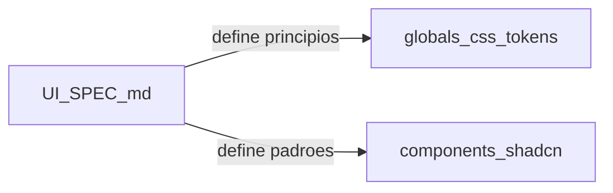

# Especificação de UI (UI_SPEC)

## 1. Propósito e âmbito

Este documento define **princípios, padrões e anti-padrões de interface** da intranet corporativa multi-tenant: tom visual, navegação, uso de tokens, componentes, tipografia, ícones e complexidade visual. Serve de referência para produto e engenharia ao desenhar e implementar ecrãs em [`apps/web`](../apps/web).

**Complementa** o contexto de produto em [PRD.md](./PRD.md) e a stack em [ENGINEERING.md](./ENGINEERING.md). **Não substitui** requisitos funcionais nem políticas de segurança — ver [SECURITY.md](./SECURITY.md). A **matriz de permissões** por perfil está em [PROPOSAL.md](./PROPOSAL.md); a UI deve **reflectir** esse acesso (menus e rotas), sem ser fonte única da regra de negócio.

**Fora de âmbito deste ficheiro:**

- **White-label ou personalização visual por tenant** — fora do MVP; identidade única da plataforma, alinhado a [PROPOSAL.md](./PROPOSAL.md).
- Auditoria página a página ou checklist de acessibilidade exaustivo (remeter a revisões de UI e boas práticas da stack quando necessário).
- Lista completa de valores de cor (oklch/hex) — a fonte de verdade está no código referenciado na secção 6.

---

## 2. Princípios de experiência

| Princípio | Significado na prática |
|-----------|-------------------------|
| **Equilíbrio corporativo / moderno / minimalista** | Aspeto profissional e previsível, sem excesso decorativo; interfaces limpas e atuais, alinhadas ao preset Shadcn do repositório. |
| **Clareza** | Utilizadores identificam rapidamente o que é título, conteúdo, ação primária vs secundária, e estado (erro, desativado). |
| **Organização** | Hierarquia visual consistente (secções, cartões, listas); alinhamento e espaçamento previsíveis. |
| **Leveza visual** | Fundos e superfícies discretas; pouca competição entre elementos; texto legível com apoio de `muted` para secundário. |
| **Cores não chamativas** | Evitar saturação extra ou acentos só para “chamar atenção”; usar tokens semânticos (`primary`, `secondary`, `muted`, `destructive`) para comunicar função, não decoração. |

---

## 3. Tipografia

- **Fontes:** definidas em [apps/web/app/layout.tsx](../apps/web/app/layout.tsx): **Inter** como `--font-sans` (corpo), **Geist** e **Geist Mono** como variáveis; `html` usa `font-sans` e `antialiased` conforme layout e [globals.css](../apps/web/app/globals.css) (`@theme inline` mapeia `--font-sans`, `--font-mono`).
- **Hierarquia:** usar escala Tailwind coerente (`text-sm`, `text-base`, `text-lg`, `text-xl` …) e peso (`font-medium`, `font-semibold`) para títulos de página, secções e corpo; texto auxiliar com `text-muted-foreground`.
- **Evitar** tamanhos em `px` fixos no código salvo excepção justificada; preferir utilitários e componentes (ex. `Card`, `CardHeader`, `CardTitle`).

---

## 4. Navegação principal

### Itens do menu (referência)

| Item | Notas |
|------|--------|
| **Dashboard** | Ponto de entrada e resumo do contexto do tenant. |
| **Colaboradores** | Módulo GC — diretório e gestão conforme perfil. |
| **Departamentos** | Módulo GD — estrutura organizacional. |
| **Eventos** | Módulo GE. |
| **Notificações** | Lista / centro de notificações in-app. |
| **Administração global** | Plano plataforma (ex.: perfil **Master**): ciclo de vida de tenants e visão agregada; não confundir com administração **dentro** do tenant. |

Os rótulos podem ajustar-se na implementação; a **semântica** e o **encadeamento com RBAC** mantêm-se.

### Visibilidade por permissões

- Cada item do menu só é **mostrado** se o utilizador autenticado tiver **permissão** para a área correspondente, segundo a política de acessos e a matriz RBAC ([PROPOSAL.md](./PROPOSAL.md)).
- **Regra:** *não mostrar* entradas para módulos ou funções a que o utilizador não tem acesso (ex.: utilizador sem permissão para **departamentos** não vê o item **Departamentos**).
- **Administração global** só para perfis autorizados no plano plataforma (ex. **Master**); utilizadores apenas no âmbito tenant **não** veem este bloco.
- A autorização **efetiva** continua a ser validada no **servidor** e nas políticas de dados; a UI **oculta** atalhos inúteis e reduz erros de perceção.

### Profundidade e estrutura

- Preferir **navegação rasa:** no máximo **um nível** de agrupamento sob cada secção principal quando possível.
- Se forem necessários **vários níveis** hierárquicos, **evitar** árvores profundas num único menu: **segregar** — por exemplo secções distintas na sidebar, segundo menu contextual, ou áreas separadas (ex. “Operação” vs “Configuração”) em vez de submenus aninhados longos.

### Identificação da empresa (tenant)

- O utilizador deve **sempre** conseguir identificar **em que organização** está a trabalhar.
- **Implementação:** mostrar o **nome da empresa** (ou identificador acordado pelo produto) de forma persistente — por exemplo na **barra lateral**, no **cabeçalho** da aplicação ou no **título** da página/app — pelo menos **num** destes locais; pode combinar-se título da página com nome do tenant.

---

## 5. Formulários: visualização vs cadastro

| Tipo de interação | Superfície preferida |
|-------------------|----------------------|
| **Visualização** de detalhes (consulta, leitura) | **Modal** (`Dialog`) ou **painel lateral** (`Sheet`), conforme complexidade e espaço. |
| **Cadastro** e **edição** de registos (fluxos de dados principais) | **Ecrã dedicado** (página completa / rota própria), como fluxo **prioritário** — não como passo principal dentro de um único modal. |

- Modais podem ser usados para **confirmações**, **passos curtos** ou **complementos**; o **trabalho de criação/alteração** de dados de negócio deve privilegiar **telas com espaço**, hierarquia clara e validação visível.
- Alinhar excepções pontuais ao produto (ex. edição rápida) sem inverter a regra geral acima sem decisão documentada.

---

## 6. Identidade visual e tokens

No MVP existe **uma identidade visual única** para toda a plataforma (sem logo/cores por tenant) — ver [PROPOSAL.md](./PROPOSAL.md).

**Fontes de verdade no código** (alterações de tema ou paleta passam por estes ficheiros e devem ser reflectidas na **versão** deste documento — secção 12):

| Artefacto | Conteúdo |
|-----------|-----------|
| [apps/web/components.json](../apps/web/components.json) | Preset Shadcn: `style` **radix-nova**, `baseColor` **mist**, `cssVariables: true`, ícones **Lucide**. |
| [apps/web/app/globals.css](../apps/web/app/globals.css) | Tokens CSS (`--background`, `--foreground`, `--primary`, `--muted`, `--destructive`, sidebar, charts, `--radius`, etc.) para `:root` e `.dark` (oklch). |
| [apps/web/app/layout.tsx](../apps/web/app/layout.tsx) | Carregamento de fontes e classes base (`antialiased`). |

**Regra de implementação:** preferir **tokens semânticos** e utilitários que os mapeiam — por exemplo `bg-background`, `text-foreground`, `border-border`, `bg-primary`, `text-muted-foreground` — em vez de cores Tailwind “cruas” (`zinc-*`, `slate-*`, etc.) em ecrãs novos. Onde código legado use cores ad hoc, alinhar gradualmente ao preset.

**Não duplicar** neste documento a tabela completa de valores oklch; consultar `globals.css`.

---

## 7. Componentes e padrões

- **Base:** componentes **Shadcn UI** em [`apps/web/components/ui`](../apps/web/components/ui), alinhados a [ENGINEERING.md](./ENGINEERING.md) (Next.js, React, Tailwind).
- **Botões:** usar `Button` com `variant` e `size` padrão da biblioteca; uma **ação primária** óbvia por região quando aplicável.
- **Ações destrutivas:** reservar `variant` / tokens **destructive** a operações irreversíveis ou críticas (eliminar, remover acesso), com confirmação quando o produto o exigir.
- **Superfícies:** `Card`, `Dialog`, `Sheet`, etc., com bordas e fundos via tokens — evitar “caixas” custom sem necessidade.
- **Densidade:** espaçamento consistente (`gap-*`, `p-*`, `space-y-*`); em ecrãs de trabalho administrativo, evitar layouts excessivamente compactos que prejudiquem leitura e clique.

---

## 8. Complexidade visual (regras)

- **Evitar** gradientes decorativos, fundos texturados pesados, sombras excessivas e ilustrações de enchimento sem função.
- **Evitar** animações chamativas ou em loop sem propósito de feedback; animações devem reforçar estado (ex. transição discreta, feedback de carregamento).
- O projeto importa **tw-animate-css** e estilos Shadcn — usar animação apenas quando melhorar percepção de estado, não como decoração principal.
- **Manter baixa complexidade visual:** poucas camadas simultâneas (fundo + cartão + lista é preferível a múltiplos planos decorativos).

---

## 9. Modo claro e escuro

Os tokens em [globals.css](../apps/web/app/globals.css) definem **ambos** os modos (`:root` e `.dark`). Novas páginas e componentes devem funcionar nos dois modos **sem** assumir apenas fundo branco ou texto preto fixos — usar tokens semânticos para que o tema escuro permaneça coerente.

---

## 10. Ícones

- Biblioteca: **Lucide**, conforme [components.json](../apps/web/components.json).
- Tamanho e cor: alinhar ao texto ou usar `text-muted-foreground` para ícones secundários; evitar ícones multicoloridos ou excessivamente grandes sem razão de hierarquia.

---

## 11. Acessibilidade (resumo)

- Contraste e foco visível beneficiam dos componentes **Radix** / Shadcn; não desactivar estilos de foco sem alternativa acessível.
- Formulários: associar labels a controlos; mensagens de erro compreensíveis.
- Este resumo **não** substitui políticas completas nem [SECURITY.md](./SECURITY.md); para auditorias de UI ou WCAG detalhado, usar processo de revisão da equipa.

---

## 12. Evolução documental

| Campo | Valor |
|-------|--------|
| **Versão** | 1.1 |
| **Data** | 2026-04-06 |
| **Preset Shadcn referenciado** | radix-nova, baseColor mist (ver `components.json`) |

Alterações relevantes a registar aqui: mudança de `baseColor`, `style`, substituição do ficheiro de tokens, decisão de produto que altere identidade única / âmbito MVP, ou alteração à navegação ou padrões de formulário.

**Alterações em 1.1:** menu principal (Dashboard, Colaboradores, Departamentos, Eventos, Notificações, Administração global); visibilidade por RBAC; profundidade de menu e segregação; identificação do tenant; padrão visualização em modais e cadastro em ecrãs dedicados.

---

**Documento:** especificação de UI complementar ao [PRD.md](./PRD.md), [PROPOSAL.md](./PROPOSAL.md) e [ENGINEERING.md](./ENGINEERING.md).